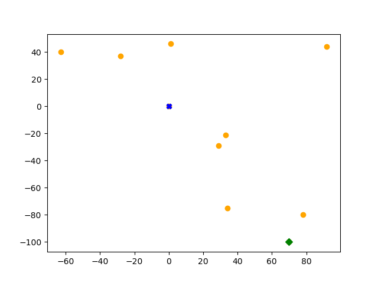
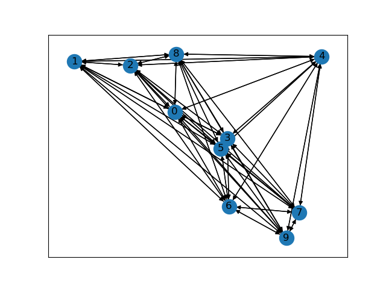
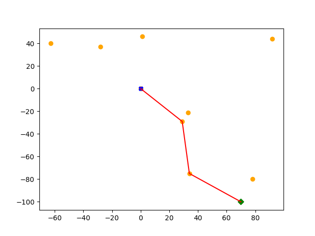
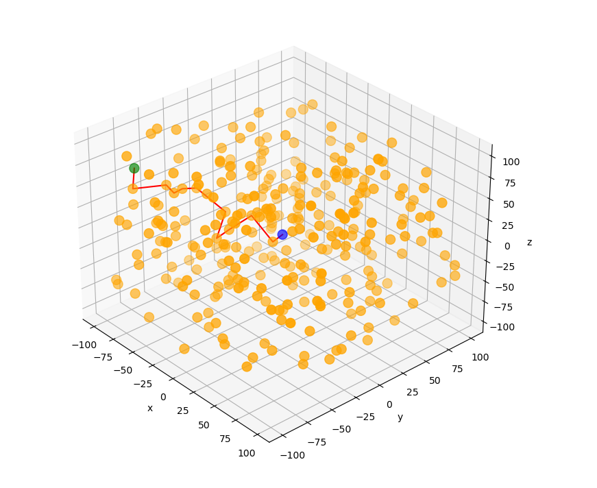

# Network_Graph_Paths

## Introduction
This repository contains route algorithms, implementation
of networkx [networkx](https://networkx.org/), [osmnx](https://osmnx.readthedocs.io/en/stable/)
and others. 

In most cases, the challenge is to find an effective path/route depending on case. 
This kind of problem belongs to [Graph Theory](https://en.wikipedia.org/wiki/Graph_theory)
and try to solve
[shortest_paths](https://en.wikipedia.org/wiki/Shortest_path_problem),
[nearest neighbor graph](https://en.wikipedia.org/wiki/Nearest_neighbor_graph),
[nearest_neighbor_search](https://en.wikipedia.org/wiki/Nearest_neighbor_search),
[travelling_salesman_problem](https://en.wikipedia.org/wiki/Travelling_salesman_problem) etc. 


## 'Nearest neighbor shortest path route' in a linear space

### The challenge,

Graph with all the nodes are connected, and we need to select the shortest possible route between two nodes 
that they can maximise the number of edges. 

### Explanation
We can imagine in real world if we assume that the **airports are the nodes** of a graph, and all are connected
each other. The airplane needs to pass through as most airports possible in the quickest possible way.

Producing the below charts 111 and 113 to easier explain the case. The challenge is translated now as 
The plane needs to go from the airport (started node, 0 in chart 113, and blue in chart 111) to 
its final destination (last node, 9 in chart 113. green in chart 111**), passing through as more airports is possible 
(orange colour in 113) by keeping the total distance the minimum.



Chart 111: Scatter plot for 10 nodes, blue is the started point, oranges are the med points and green out final destination



Chart 113: Directed graphs with 10 nodes, 0 is the source (started node) and target is the 9(ended node).

### Approach
There are many approaches to solve this problem; The custom function **nearest_neighbor_triangle_route**  
implements a geometrical procedure using triangle distances between the current, target and selected nearest node, 
with functionality to search 'k' nearest node that minimise the triangle distances to the target.  

```
 - i,j,n,N are the nodes [0, N]
        i is the currect node 
        j the neiboor node in search, 
        n the next path node, 
        N the final node      
 - d(i,j) is the distance between the node i and j
       d(O,N) is the distance betrween started and final node
       d(1,2) is the distance between the node 1 and 2
       d(i,N) is the distance between node i and destination
 - k   [1,N], neibour to search on next step d(ijnn in k,)      
 steps
 - exclude nodes j where d(j,N) > d(0,N)       
 - exclude nodes from edges where d(i,j)>d(0,N)
 
 -> final Graph G
 
 for each i in G,  
      select j 
        from j in [k-range nodes] where d(i,j) + d(j,N) = min([d(jk,N)])
             n = j
             where d(j,N)+d(ij) < d(jk,N)+d(imjk)
         go to next j
         exclude the node j
     do till n = N               
```

### Implementation in our example with k neighbour search = 1

```python
from src.create_data import CreateInputs
from src.create_charts import plot_2d_network
from src.generate_paths import nearest_neighbor_triangle_route

coords, coords_df = CreateInputs(N=500, space='2d', min_max=100, random_seed=1).generate()
d, routes, edge_distance, Total_distance, df = nearest_neighbor_triangle_route(coords, k=1)
plot_2d_network(coords)
```



### Implementation in random nodes with k neighbour search = 1,2,3,4,5,10,none
A simulation example for different number nodes, seed and number of k. 
 - We need to pass through the max number of nodes, so we select to search k=1. 
 - As k is larger, the algorithm minimise triangle distance, and tries to make the route as much linear to 
   from source to target.


## Snippet

```python
from src.create_data import CreateInputs
from src.create_charts import plot_2d_network, plot_3d_network
from src.generate_paths import nearest_neighbor_triangle_route

coords, coords_df = CreateInputs(N=300, space='3d', min_max=100, random_seed=1).generate()
d, routes, edge_distance, total_distance, df = nearest_neighbor_triangle_route(coords, k=1)
plot_3d_network(coords_df, routes)
```


## Sources
